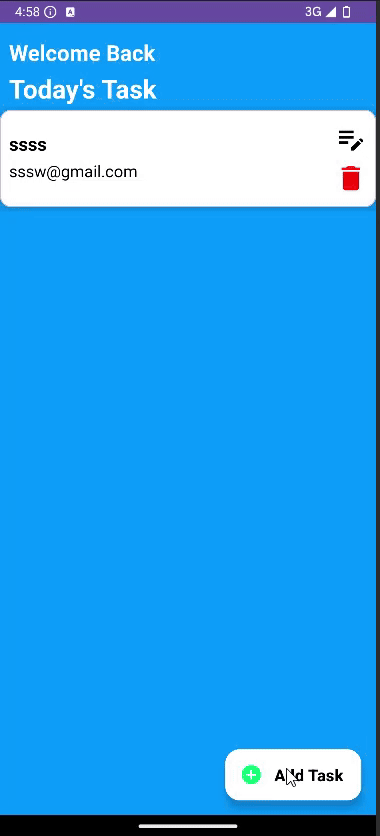

# My Application

This Android application demonstrates basic CRUD (Create, Read, Update, Delete) operations using Kotlin, Fragments, Navigation Component, ViewModel, and LiveData. It follows a simple architecture to manage a list of user data.



## Features

- Add new user entries with a title and description.
- View a list of all users.
- Edit an existing user entry.
- Delete a user entry.
- View detailed information of a user.
- Uses MVVM architecture with LiveData.
- Navigation between fragments using the Navigation component.

## Screens / Fragments

- **AddFragment**: Allows the user to input a title and description to create a new user entry.
- **ListFragment**: Displays a list of all users with options to view, edit, or delete.
- **EditFragment**: Enables updating an existing user entry.
- **DetailedFragment**: Shows the full details of a user.

## Architecture

- **MVVM (Model-View-ViewModel)** pattern for better separation of concerns and state management.
- Uses **ViewModel** for storing and managing UI-related data in a lifecycle conscious way.
- Uses **LiveData** to observe data changes and update UI accordingly.
- Uses **Navigation Component** for smooth and safe fragment navigation.

## Technologies

- Kotlin
- Android Jetpack (ViewModel, LiveData, Navigation)
- ViewBinding
- RecyclerView

## Project Structure

<pre lang="nohighlight"> ``` ├── AddFragment.kt ├── EditFragment.kt ├── DetailedFragment.kt ├── ListFragment.kt ├── ViewModel.kt ├── UserData.kt ├── UserDataAdapter.kt ├── res/ │ ├── layout/ │ │ ├── fragment_add.xml │ │ ├── fragment_edit.xml │ │ ├── fragment_detailed.xml │ │ ├── fragment_list.xml │ └── navigation/ │ └── nav_graph.xml ``` </pre>

pgsql
Copy
Edit

## Setup

1. Clone the repository.
2. Open the project in Android Studio.
3. Build and run on an emulator or real device.

## Notes

- The app uses in-memory data storage (LiveData) without a database; data will reset on app restart.
- All input fields must be filled before adding or updating an entry.

## Future Improvements

- Integrate Room database for persistent storage.
- Add form validation using Android’s `TextInputLayout`.
- Add image upload and profile viewing.
- Improve UI/UX with Material Design components.

---

Made with ❤️ using Kotlin and Jetpack.
